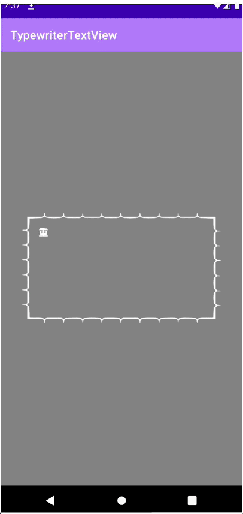

# TypewriterTextView
TypewriterTextView, which inherits from TextView, displays characters one by one like a typewriter.

タイプライターを打つように、１文字ずつテキストを表示するTextViewです。



デフォルトの表示間隔は0.05秒です。
setDelay(millis: Long)で設定できます。

表示したいテキストを渡すと、タイプライターのようなアニメーションが始まります。
```kotlin
textView.animateText("表示したいテキスト")
```
